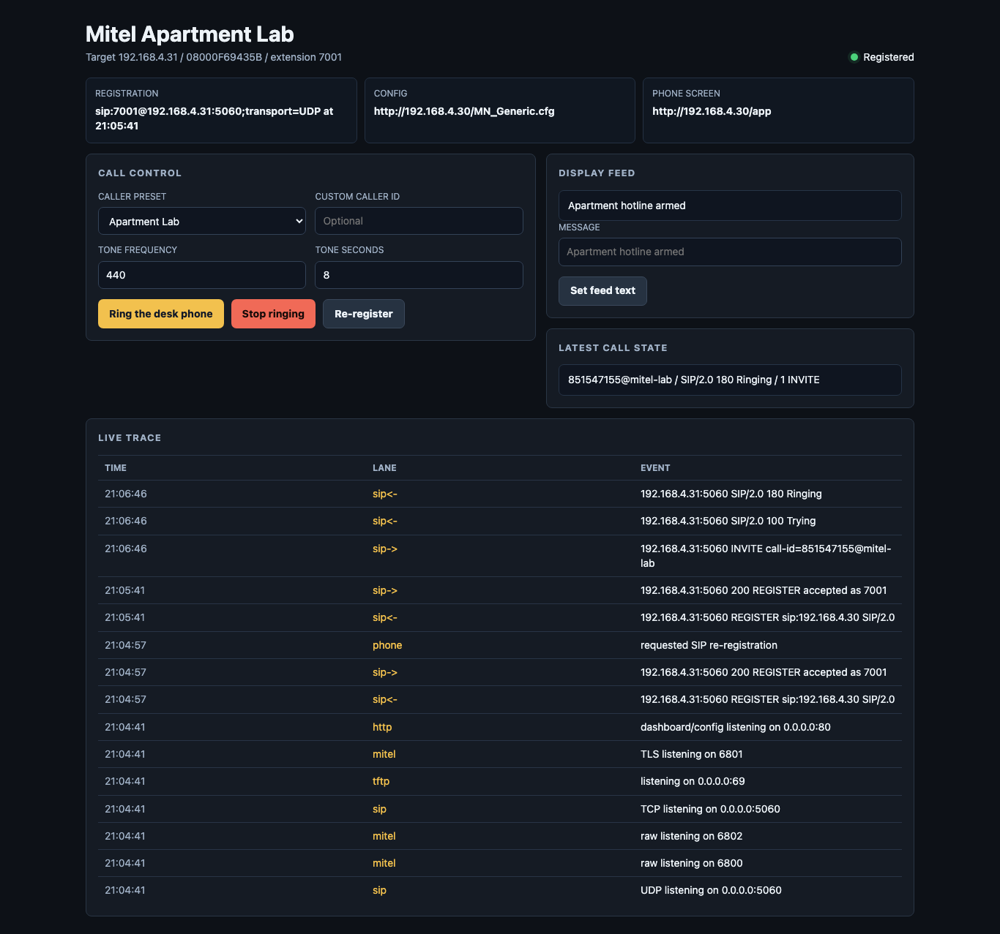
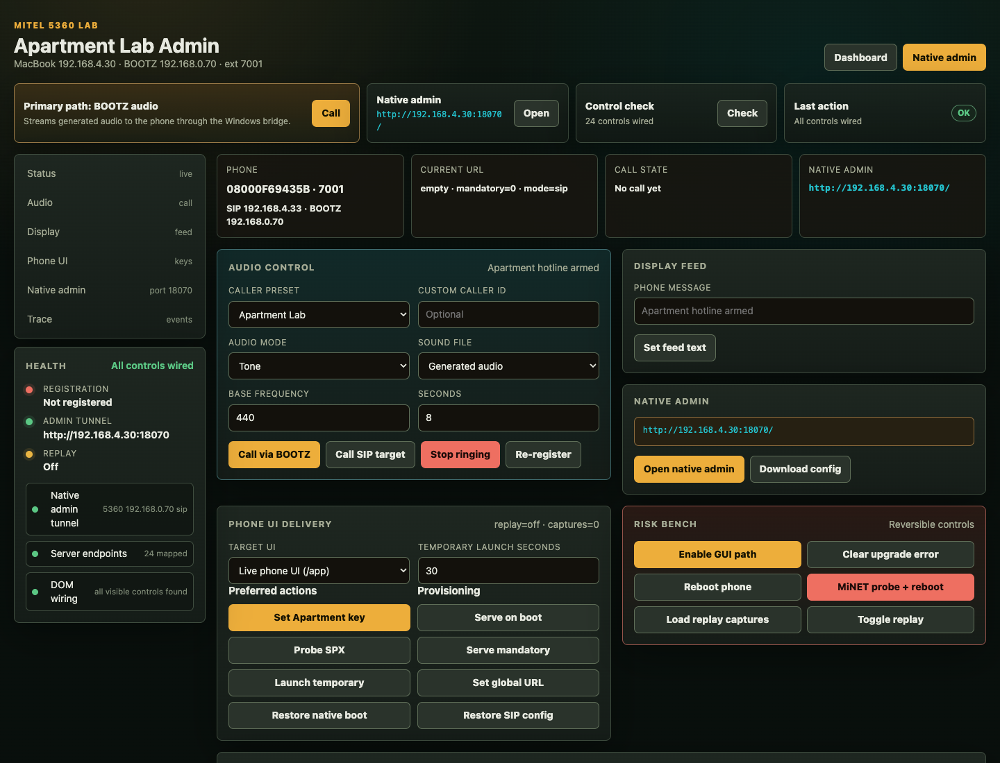

# mitel-5360-lab

> Pick up the handset. Talk to an AI. Hear it respond through the earpiece in GLaDOS's voice.

This is a lab for hacking the **Mitel 5360 IP phone** — a vintage enterprise desk phone you can get for ~$10 on eBay. The lab turns it into a full AI terminal: dial an extension, have a conversation with Claude, hear the response synthesized through the phone's speaker. Along the way it also does SIP control, RTP audio injection, HTML GUI replacement, DHCP/TFTP provisioning, and firmware reverse engineering.

No Mitel controller (MCD/3300) required. The phone speaks SIP; the lab is a SIP registrar.



---

## What works

| Capability | Status |
|---|---|
| SIP registration, ring, cancel, caller-ID spoofing | ✅ |
| RTP audio injection (soundboard, TTS, any audio) | ✅ |
| HTML app serving to the phone's touchscreen | ✅ |
| Full GUI replacement via official Mitel HTML Toolkit `.spx` packages | ✅ |
| TFTP/HTTP provisioning + firmware intercept | ✅ |
| Phone web admin automation (HTTP Basic auth) | ✅ |
| AI voice bridge: dial → speak → Whisper STT → Claude → GLaDOS TTS → RTP | ✅ |
| Config backup from phone's `/download.txt` endpoint | ✅ |
| DHCP responder for zero-touch provisioning | ✅ |

---

## Architecture

```
┌─────────────────────────────────────┐
│         Mitel 5360 IP Phone         │
│  SIP / RTP  │  HTTP admin  │  TFTP  │
└──────┬──────┴──────┬───────┴───┬────┘
       │              │           │
       ▼              ▼           ▼
┌──────────────────────────────────────────────────────┐
│                    mitel_lab.py                       │
│  SIP server (5060)  │  HTTP dashboard (:80)  │  TFTP │
└──────────────────────────┬───────────────────────────┘
                           │
              SIP INVITE → extension 7002
                           │
                           ▼
              ┌────────────────────────┐
              │   voice/voice_loop.py  │
              │                        │
              │  G.711 µ-law RTP in    │
              │  → upsample to 16kHz   │
              │  → silero-VAD          │  turn detection
              │  → faster-whisper      │  speech-to-text
              │  → SSH tunnel          │  → AI backend
              │  → GLaDOS Piper TTS    │  text-to-speech
              │  → downsample 8kHz     │
              │  → µ-law RTP out       │
              └────────────────────────┘
```

The SSH tunnel connects to any backend that accepts newline-delimited JSON and streams tokens back. The reference implementation wraps Claude Code.

---

## Quick start

### Prerequisites

- Python 3.11+
- A Mitel 5360 IP phone on your local network (SIP firmware, not MiNET)
- `sudo` for the TFTP server (port 69) and DHCP responder

```bash
pip install faster-whisper onnxruntime numpy
# Pick a TTS backend — GLaDOS Piper (local), ElevenLabs (API), or generic Piper
pip install piper-tts          # GLaDOS / Piper
pip install elevenlabs         # ElevenLabs
```

### Configure

```bash
# Your machine's LAN IP and the phone's IP
export LAB_HOST=192.168.x.x
export PHONE_HOST=192.168.x.y
export PHONE_USER=7001          # SIP extension assigned to the phone
```

For the AI voice bridge:

```bash
export AI_VPS_HOST=your.server.com   # or leave empty to skip the voice bridge
export AI_VPS_USER=deploy
export AI_VPS_KEY=~/.ssh/your_key
export AI_BRIDGE_CMD=/home/deploy/ai-phone/voice.sh
export MITEL_VOICE_BACKEND=glados    # glados | elevenlabs | piper
```

### Run

```bash
sudo python3 mitel_lab.py
```

Open `http://LAB_HOST` for the dashboard. The phone will register via SIP and start receiving provisioning from the lab server.

Or use the control script:

```bash
./mitel_lab_control.sh start    # starts lab + DHCP responder
./mitel_lab_control.sh stop
./mitel_lab_control.sh status
```

---

## AI voice bridge

Dial extension `7002` from the Mitel phone (or program a speed-dial key via the dashboard). The call flows:

1. Phone sends a SIP `INVITE` to `sip:7002@LAB_HOST`
2. Lab answers `200 OK` with an SDP offer, opens a local RTP port
3. G.711 µ-law audio streams in at 8kHz
4. `silero-VAD` detects end-of-turn (silence threshold)
5. `faster-whisper` transcribes the audio to text
6. Text is sent over an SSH tunnel to your AI backend as `{"prompt": "..."}`
7. Backend streams back `{"type":"token","token":"..."}` frames
8. Tokens are synthesized incrementally with GLaDOS Piper TTS
9. Audio is downsampled to 8kHz, µ-law-encoded, and sent back as RTP

The SSH tunnel uses `ControlMaster` to stay warm between turns, cutting cold-start latency from ~2s to ~50ms.

### Minimal AI backend

```bash
#!/usr/bin/env bash
# /home/deploy/ai-phone/voice.sh
# Receives JSON on stdin, streams Claude tokens back as JSON
while IFS= read -r line; do
    prompt=$(echo "$line" | python3 -c "import sys,json; print(json.load(sys.stdin)['prompt'])")
    echo "$prompt" | claude --output-format stream-json --no-preamble
done
```

### TTS voices

| Backend | Env var | Notes |
|---------|---------|-------|
| `glados` | `MITEL_VOICE_BACKEND=glados` | GLaDOS voice via Piper + ONNX model. Local, no API key. |
| `elevenlabs` | `MITEL_VOICE_BACKEND=elevenlabs` | ElevenLabs API. Set `ELEVENLABS_API_KEY`. |
| `piper` | `MITEL_VOICE_BACKEND=piper` | Any Piper-compatible voice. Set `MITEL_VOICE_NAME`. |

---

## HTML Toolkit / Full GUI Replacement

The Mitel 5360 supports a **Full Screen GUI Replacement** (GRM) mode where a `.spx` package completely takes over the phone's UI — all physical keys captured, full touchscreen events, always-on display, no way to exit. This is the intended production feature for deploying custom apps on 5360 fleets.

We reverse-engineered the `.spx` packaging format from the official [Mitel HTML Toolkit v2.2.0.4](https://www.mitel.com) and can now build and deploy full GUI replacement apps without a 3300 MCD controller.

```bash
# Build and deploy a GRM app
./mitel_package_grm.sh            # produces ApartmentLabGRM.official.spx
./mitel_package_grm_rich.sh       # richer variant with additional resources
```

The packaging toolchain uses the official `HtmlAppPackagerAndInstaller.jar` from the toolkit. Apps are served over HTTP; the phone fetches and installs them when an HTML Application key is programmed.

See [`mitel_reverse_engineering_notes.md`](mitel_reverse_engineering_notes.md) for the complete breakdown of what works standalone vs. what needs the MCD deployment path.



---

## File reference

| File | Description |
|------|-------------|
| `mitel_lab.py` | Core server — SIP (UDP+TCP), HTTP dashboard, TFTP, RTP injection, AI voice bridge |
| `voice/voice_loop.py` | Voice pipeline: VAD → Whisper STT → AI bridge → TTS → RTP |
| `voice/tts_glados.py` | GLaDOS Piper TTS synthesizer (ONNX, local) |
| `voice/tts_elevenlabs.py` | ElevenLabs cloud TTS |
| `voice/tts_piper.py` | Generic Piper TTS |
| `voice/glados_phonemizer.py` | GLaDOS-specific phoneme preprocessing |
| `mitel_lab_control.sh` | Start/stop/status wrapper for lab + DHCP |
| `mitel_package_grm.sh` | Package HTML app as official `.spx` (basic GRM) |
| `mitel_package_grm_rich.sh` | Package rich GRM `.spx` |
| `mitel_package_redirect_fs.sh` | Package redirect/filesystem `.spx` |
| `mitel_dhcp_responder.py` | DHCP responder for zero-touch provisioning |
| `mitel_capture_ports.py` | Traffic capture/mirror on phone ports |
| `mitel_hybrid_probe.py` | Probe the phone's SIP/HTTP/MiNET stack |
| `mitel_tftp_logger.py` | TFTP request logger |
| `mitel_tls_probe.py` | TLS probe |
| `mitel_gateway_probe*.sh` | Network gateway probes |
| `mitel_reverse_engineering_notes.md` | Full RE notes — SIP, HTML Toolkit, firmware, MiNET |

---

## Environment variables

| Variable | Default | Description |
|----------|---------|-------------|
| `LAB_HOST` | `192.168.4.30` | Your machine's LAN IP |
| `PHONE_HOST` | `192.168.4.33` | Mitel 5360's IP |
| `PHONE_USER` | `7001` | Phone's SIP extension |
| `PHONE_WEB_USER` | `admin` | Phone web admin username |
| `PHONE_WEB_PASS` | `5360` | Phone web admin password |
| `AI_EXT_USER` | `7002` | AI voice bridge extension |
| `AI_VPS_HOST` | _(none)_ | AI backend hostname/IP |
| `AI_VPS_KEY` | _(none)_ | Path to SSH private key for AI backend |
| `AI_BRIDGE_CMD` | `/home/deploy/ai-phone/voice.sh` | Remote command to run on AI backend |
| `MITEL_VOICE_BACKEND` | `elevenlabs` | TTS backend: `glados`, `elevenlabs`, or `piper` |
| `STATIC_FILE_DIR` | `./static-files` | Directory to serve via TFTP/HTTP |
| `RESEARCH_DIR` | `./research` | Research artifacts directory |

---

## Hardware

- **Phone:** Mitel 5360 IP Phone (~$10 on eBay)
- **Firmware:** SIP `06.04.01.08` — standard SIP, no controller needed
- **Tested on:** macOS + Python 3.11, connected over a home LAN

The phone has a color touchscreen, speakerphone, a full keypad, and programmable soft keys. It runs a web server at port 80 and accepts SIP provisioning via TFTP/HTTP. Nothing about this setup requires enterprise gear.
